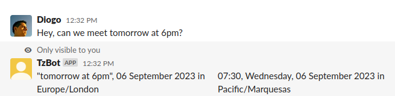

<!--
-- SPDX-FileCopyrightText: 2022 Serokell <https://serokell.io/>
--
-- SPDX-License-Identifier: MPL-2.0
-->

# tzbot

`tzbot` is a Slack bot that detects messages with references to some point in time
and converts them to your timezone.

When a user in the Europe/Riga timezone sends a message such as:

> Hey, can we meet tomorrow at 6pm?

Users will receive an
"ephemeral message" (a message visible only to that user):

## Features

* [x] When a Slack message is edited, the bot sends a new ephemeral message.
* [x] Time references in code blocks are ignored.
* [x] Supports messages sent to public and private channels and shared channels
      where the bot is present; replies in threads are also supported.
* [x] Users can send direct messages to the bot to convert time references.
* [x] Every message in the workspace can be converted by selecting _Convert time references_
      from the message's context menu `⋮`.
* [x] If a message contains wrongly converted or unrecognized time references, users can
      report an issue from a message's context menu `⋮`;
      the feedback can be either recorded to a file or sent to a configured
      Slack channel.
* [x] Detects references to:
  * invalid times (e.g., "tomorrow at 1:30", but the clocks skip from 00:59 to 02:00 on that day).
  * ambiguous times (e.g. "tomorrow at 1:30", but the clocks are set back from 01:59
    to 01:00 on that day, meaning the time "1:30" will occur twice at two different offsets).
* [x] Handles references with timezones, offsets and _some_ timezone abbreviations
  (see [timezone_abbreviations.md](docs/timezone_abbreviations.md) for a full list).
    * > tuesday at 11am Australia/Brisbane
    * > tuesday at 11am UTC+3
    * > tuesday at 11am CST

  If a word _looks_ like a timezone abbreviation but is not known by the bot, the user is given
  a hint of what abbreviations the sender probably meant.
* [ ] Multiple time references with shared context are processed correctly. For example,
      "Let's meet between 10 and 11pm tomorrow" contains two references: "10(pm) (tomorrow)" and "11pm tomorrow".

## Contributing

See:
  * [Contributing](CONTRIBUTING.md)
  * [Development](docs/development.md)
  * [Edge cases & pitfalls](docs/pitfalls.md)
  * [Implementation details](docs/implementation_details.md)

## Comparison with similar tools

* Timely is very similar to `tzbot`, but it:
  * Reacts everytime someone says the word "now", which can be a bit annoying when you say e.g.
    "I just merged my PR, we can _now_ use this feature".
  * Reacts to timestamps in codeblocks.
    This means that when you post some application's logs in Slack, you get flooded with notifications.
  * Does not react when a user edits their message.
  * Does not understand references that include a timezone name or an offset.
* Timezone Butler:
  * Assumes all references are relative to the current day, i.e., it doesn't distinguish
    "10am" from "10am tomorrow", which can have an impact when DST changes occur.
  * It understands "10am" but not "10 am".
  * It incorrectly interprets "3:30" as "3:30pm", instead of "3:30am".
  * Does not react when a user edits their message.
  * Does not understand references that include a timezone name or an offset.
